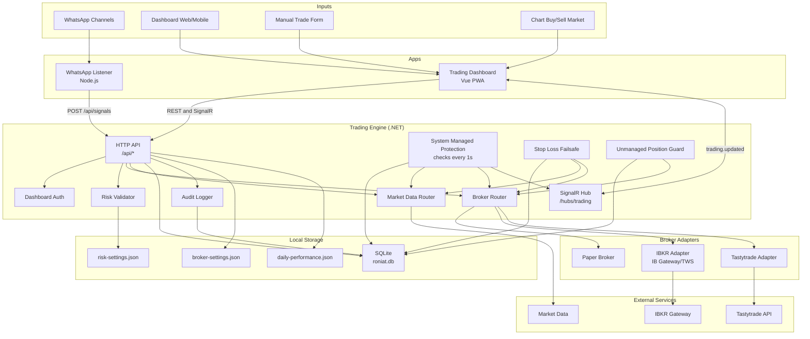
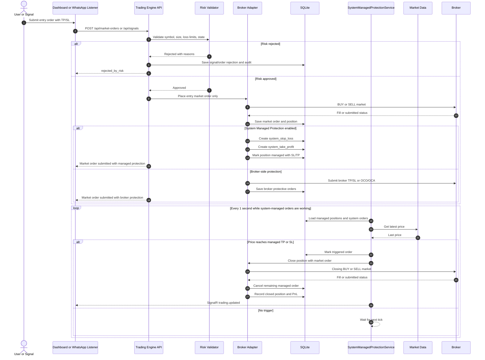

# RoniAT Mermaid Diagrams

## Architecture

```mermaid
flowchart TB
    subgraph Inputs["Inputs"]
        WA["WhatsApp Channels"]
        UI["Dashboard Web/Mobile"]
        Manual["Manual Trade Form"]
        ChartTrade["Chart Buy/Sell Market"]
    end

    subgraph Apps["Apps"]
        Listener["WhatsApp Listener<br/>Node.js"]
        Dashboard["Trading Dashboard<br/>Vue PWA"]
    end

    subgraph Engine["Trading Engine (.NET)"]
        Auth["Dashboard Auth"]
        API["HTTP API<br/>/api/*"]
        SignalHub["SignalR Hub<br/>/hubs/trading"]
        Risk["Risk Validator"]
        Router["Broker Router"]
        MarketData["Market Data Router"]
        SystemProtection["System Managed Protection<br/>checks every 1s"]
        Failsafe["Stop Loss Failsafe"]
        UnmanagedGuard["Unmanaged Position Guard"]
        Audit["Audit Logger"]
    end

    subgraph Storage["Local Storage"]
        SQLite["SQLite<br/>roniat.db"]
        RiskSettings["risk-settings.json"]
        BrokerSettings["broker-settings.json"]
        DailyPerf["daily-performance.json"]
    end

    subgraph Brokers["Broker Adapters"]
        Paper["Paper Broker"]
        IBKR["IBKR Adapter<br/>IB Gateway/TWS"]
        Tasty["Tastytrade Adapter"]
    end

    subgraph External["External Services"]
        IBGateway["IBKR Gateway"]
        TastyAPI["Tastytrade API"]
        MarketFeeds["Market Data"]
    end

    WA --> Listener
    Listener -->|"POST /api/signals"| API

    UI --> Dashboard
    Manual --> Dashboard
    ChartTrade --> Dashboard
    Dashboard -->|"REST and SignalR"| API
    Dashboard <-->|"trading.updated"| SignalHub

    API --> Auth
    API --> Risk
    Risk --> RiskSettings
    API --> Router
    API --> MarketData
    API --> SQLite
    API --> Audit

    Router --> Paper
    Router --> IBKR
    Router --> Tasty

    IBKR --> IBGateway
    Tasty --> TastyAPI
    MarketData --> MarketFeeds

    SystemProtection --> SQLite
    SystemProtection --> MarketData
    SystemProtection --> Router
    SystemProtection --> SignalHub

    Failsafe --> SQLite
    Failsafe --> MarketData
    Failsafe --> Router

    UnmanagedGuard --> SQLite
    UnmanagedGuard --> Router

    Audit --> SQLite
    API --> BrokerSettings
    API --> DailyPerf
```

## System Managed Protection

```mermaid
sequenceDiagram
    autonumber

    actor Trader as User or Signal
    participant UI as Dashboard or WhatsApp Listener
    participant API as Trading Engine API
    participant Risk as Risk Validator
    participant Broker as Broker Adapter
    participant DB as SQLite
    participant Protect as SystemManagedProtectionService
    participant Feed as Market Data
    participant ExtBroker as Broker

    Trader->>UI: Submit entry order with TP/SL
    UI->>API: POST /api/market-orders or /api/signals
    API->>Risk: Validate symbol, size, loss limits, state

    alt Risk rejected
        Risk-->>API: Rejected with reasons
        API->>DB: Save signal/order rejection and audit
        API-->>UI: rejected_by_risk
    else Risk approved
        Risk-->>API: Approved
        API->>Broker: Place entry market order only
        Broker->>ExtBroker: BUY or SELL market
        ExtBroker-->>Broker: Fill or submitted status
        Broker->>DB: Save market order and position

        alt System Managed Protection enabled
            Broker->>DB: Create system_stop_loss
            Broker->>DB: Create system_take_profit
            Broker->>DB: Mark position managed with SL/TP
            API-->>UI: Market order submitted with managed protection
        else Broker-side protection
            Broker->>ExtBroker: Submit broker TP/SL or OCO/OCA
            Broker->>DB: Save broker protective orders
            API-->>UI: Market order submitted with broker protection
        end
    end

    loop Every 1 second while system-managed orders are working
        Protect->>DB: Load managed positions and system orders
        Protect->>Feed: Get latest price
        Feed-->>Protect: Last price

        alt Price reaches managed TP or SL
            Protect->>DB: Mark triggered order
            Protect->>Broker: Close position with market order
            Broker->>ExtBroker: Closing BUY or SELL market
            ExtBroker-->>Broker: Fill or submitted status
            Broker->>DB: Cancel remaining managed order
            Broker->>DB: Record closed position and PnL
            Protect-->>UI: SignalR trading.updated
        else No trigger
            Protect-->>Protect: Wait for next tick
        end
    end
```
